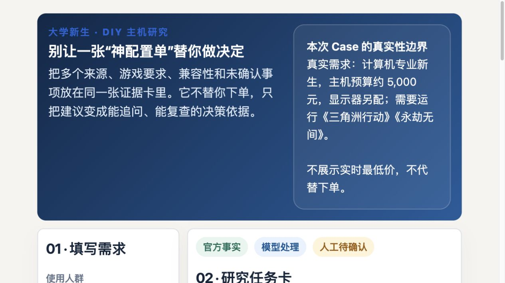

# DIY PC Advisor

一个可运行的 DIY 主机推荐产品：用户填写预算、用途与限制，产品调用 AI 模型生成最终配置、部件理由、估算预算、购买前核验项，并展示完整运行过程。

## 支持的模型调用方式

- **ArkCLI**：适合已登录 ArkCLI 的本机，默认模型为 `doubao-seed-evolving-latest-version`。
- **OpenAI 兼容 API**：填写兼容接口地址、模型 ID 和 API Key；Key 只在当前页面内存中使用，不写入浏览器存储、文件或仓库。

## 运行

需要 Node.js 18+。无第三方依赖：

```bash
npm start
```

打开 `http://127.0.0.1:8787`，点击右上角“参数配置”：填写调用方式、模型 ID、接口地址与 Key，先点“检测接口”，检测通过后才可保存。产品会保存调用方式、模型 ID 和接口地址；刷新页面后需重新填写 API Key 并重新检测。

## 界面素材

下图是本项目早期“证据卡”工作流的高清界面记录，用于说明需求与证据如何被组织；当前版本在此基础上增加了 ArkCLI / OpenAI 兼容 API 配置、最终推荐配置和过程摘要。它不是实时价格或店铺信息的证明。



## 每次运行的可见过程

1. 需求与接口参数校验
2. 根据预算、用途与固定游戏事实构建任务
3. 调用模型（仅显示调用方式与模型 ID）
4. 校验部件、理由与购买核验项的结构
5. 渲染最终配置，并可导出 Markdown 文档与 PNG 方案卡

这些阶段由服务端实时推送；不会展示模型思考过程或原始回复。产品不会保存 API Key；配置结果与过程摘要仅保存在浏览器本地。

## 重要边界

最终配置的价格仅为模型估算。购买前应在当天商品页和厂商页核验实时价格、库存、活动、接口、尺寸、BIOS、供电与售后；本产品不会访问电商账号或代替用户下单。

固定的游戏事实来自 Steam 页面：

- [Delta Force](https://store.steampowered.com/app/2507950/Delta_Force/?cc=us&l=schinese)
- [NARAKA: BLADEPOINT](https://store.steampowered.com/app/1203220/?l=schinese)
